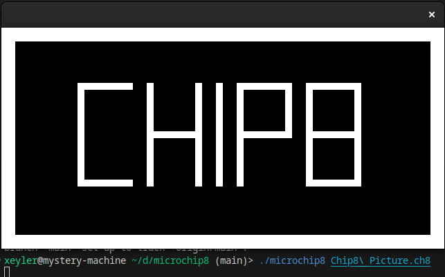

# MICROCHIP-8

Hello! This is a C99 CHIP-8 emulator I wrote over the course of a couple hours.

The design decisions that were made have been of questionable quality. The sound is horrible, don't look at the sound code. In fact, maybe don't listen to it either. Just mute your audio before running the emulator. Also, I don't know why I used a struct to create a map from SDL keys to the emulator internal state when I could have just used an array. The build system is a bash script that calls gcc. I define preprocessor directives and constants to be of the same value and use them interchangeably.

I think that's pretty much it, though. Other than the above, it's perfect code.

# Installation/running

1. Clone the repository
2. Install SDL2 and gcc on your computer
3. Run `build.sh` to compile
4. Run `./microchip8 romfile`
